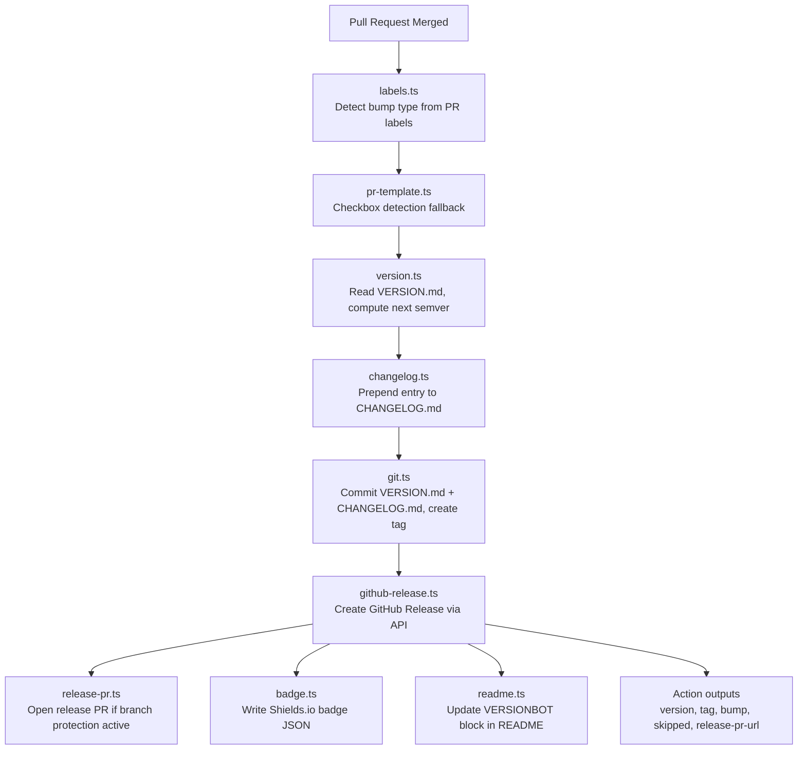

# Architecture

## Data Flow

## Module Responsibilities

| Module                  | Responsibility                                                                                    |
| ----------------------- | ------------------------------------------------------------------------------------------------- |
| `src/labels.ts`         | Pure function. Maps PR label strings to bump type. No I/O.                                        |
| `src/pr-template.ts`    | Scans the merged PR body for checked Markdown checkboxes matching configured label names.         |
| `src/version.ts`        | Reads and writes `VERSION.md`. Uses the `semver` npm package.                                     |
| `src/changelog.ts`      | Reads and writes `CHANGELOG.md`. Prepends a formatted entry.                                      |
| `src/git.ts`            | Runs git commands via `@actions/exec`. All calls use array-form args.                             |
| `src/github-release.ts` | Calls GitHub REST API via `@actions/github` Octokit.                                              |
| `src/release-pr.ts`     | Commits release files to a `release/{tag}` branch and opens a PR when `use-release-pr` is set.    |
| `src/badge.ts`          | Writes a Shields.io-compatible badge JSON file when `generate-badge` is enabled.                  |
| `src/readme.ts`         | Updates the VERSIONBOT block in the target README file when `update-readme` is enabled.           |
| `src/index.ts`          | Entry point. Reads all `@actions/core` inputs. Wires all modules. Handles dry-run and error flow. |

## Runtime

TypeScript source in `src/` is compiled to a single `dist/index.js` via `@vercel/ncc`. GitHub runs this file directly on the runner using Node.js 20. `dist/index.js` is committed to the repo so GitHub can execute it without a build step at action invocation time.

## Key Design Decisions

See [stu/memory.md](../stu/memory.md) for full ADR log.

- **PR labels over conventional commits** — explicit, visible, auditable
- **CommonJS over ESM** — maximum compatibility with `@actions/*` packages and `@vercel/ncc`
- **`@actions/exec` for git** — array-form args prevent shell injection; stdout/stderr captured in workflow logs
- **`dist/` committed to repo** — required by GitHub Actions runtime; CI enforces sync with `git diff --exit-code dist/`
